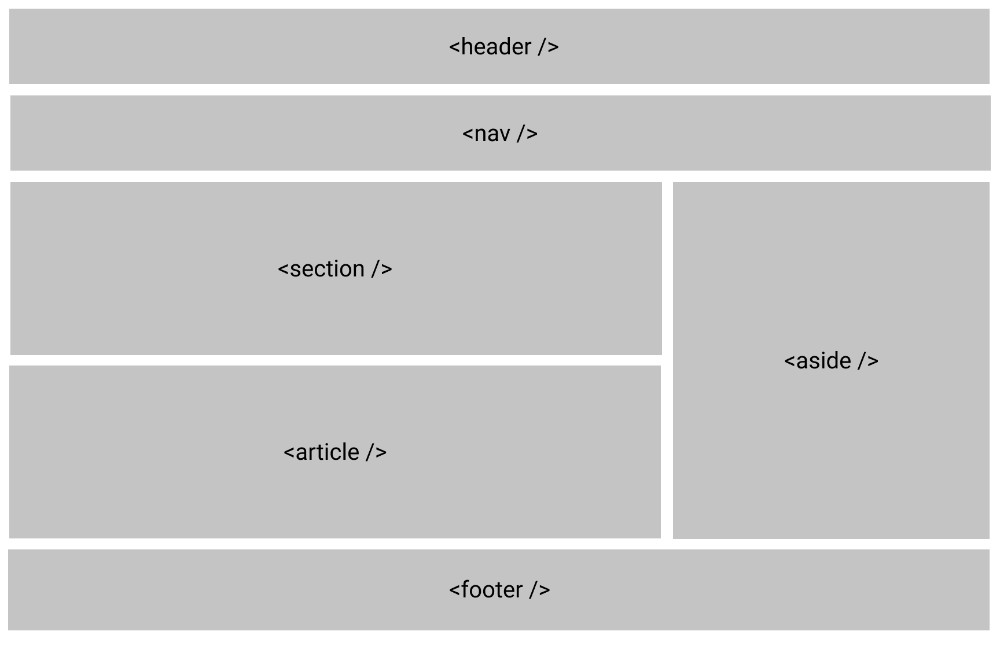
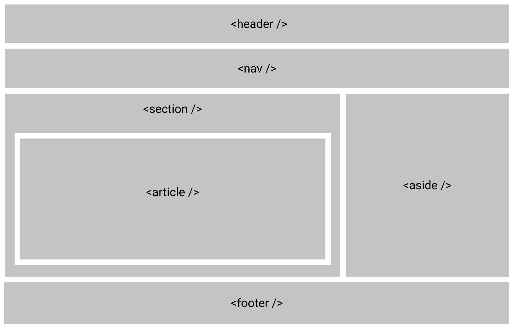
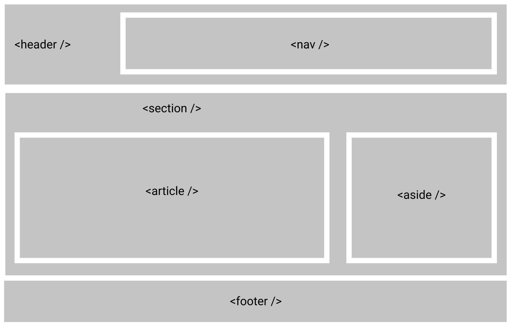
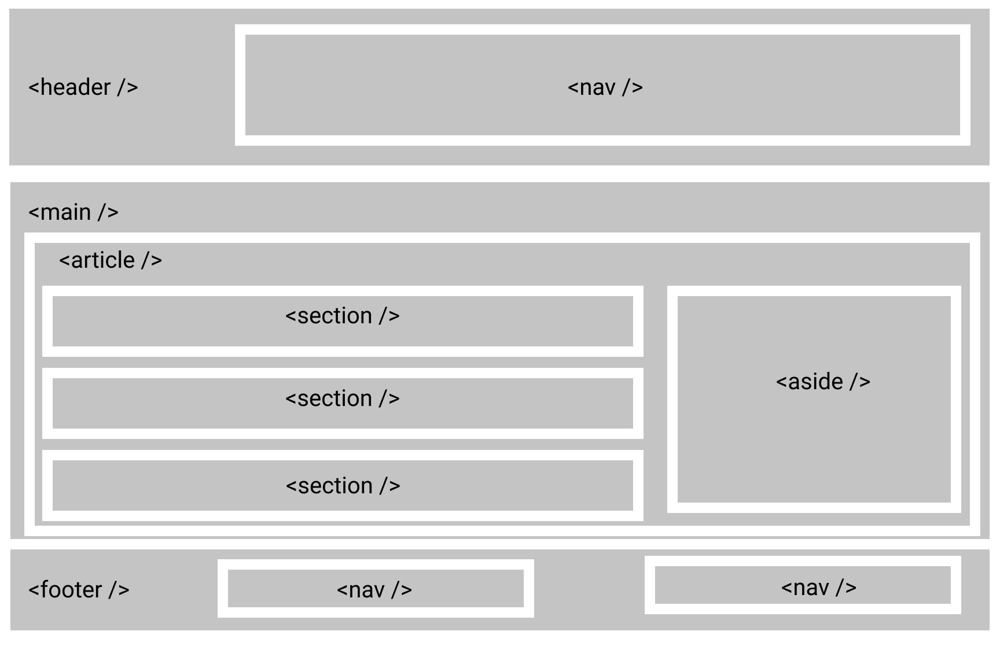

## Problem:

There is simple HTML:

```html
<body>
  <div class="header">
    <div class="nav"></div>
  </div>
  <div class="wrapper">
    <div class="section"></div>
    <div class="section"></div>
    <div class="section"></div>
  </div>
  <div class="footer"></div>
</body>
```

And its CSS:

```css
div.header {
  /* Some properties */
}
div.nav {
  /* Some properties */
}
div.wrapper {
  /* Some properties */
}
div.section {
  /* Some properties */
}
div.footer {
  /* Some properties */
}
```

⇒ **HTML 5** provide semantic elements for shorten declaration, so just use the right element for the right job.

## Pros

- Search engines will consider its contents as important keywords to influence the page's search ranking.
- Screen readers can use it as a signpost to help visually impaired users navigate a page.
- Finding blocks of meaningful code is significantly easier than searching through endless `div`s with or without semantic classes.

## Common semantic elements

| Element            | Description                                                                                                                                                                              |
| ------------------ | ---------------------------------------------------------------------------------------------------------------------------------------------------------------------------------------- |
| article            | Represents a self-contained composition in a document, page, application, or site, which is intended to be independently distributable or reusable.                                      |
| aside              | Represents a portion of a document whose content is only indirectly related to the document's main content.                                                                              |
| footer             | Represents a footer for its nearest sectioning content or sectioning root element.                                                                                                       |
| header             | Represents introductory content, typically a group of introductory or navigational aids.                                                                                                 |
| h1,h2,h3,h4,h5,h6  | Represent six levels of section headings.                                                                                                                                                |
| main               | Represents the dominant content of the body of a document.                                                                                                                               |
| nav                | Represents a section of a page whose purpose is to provide navigation links, either within the current document or to other documents.                                                   |
| section            | Represents a generic standalone section of a document, which doesn't have a more specific semantic element to represent it.                                                              |
| details, summary   | Creates a disclosure widget in which information is visible only when the widget is toggled into an "open" state.<br />https://developer.mozilla.org/en-US/docs/Web/HTML/Element/details |
| figure, figcaption | Represents self-contained content, potentially with an optional caption.<br />https://developer.mozilla.org/en-US/docs/Web/HTML/Element/figure                                           |
| mark               | Represents text which is marked or highlighted.<br />https://developer.mozilla.org/en-US/docs/Web/HTML/Element/mark                                                                      |
| time               | Represents a specific period in time.<br />https://developer.mozilla.org/en-US/docs/Web/HTML/Element/time                                                                                |

### Examples:









## Resources:

[https://developer.mozilla.org/en-US/docs/Glossary/Semantics](https://developer.mozilla.org/en-US/docs/Glossary/Semantics)

[https://developer.mozilla.org/en-US/docs/Web/HTML/Element](https://developer.mozilla.org/en-US/docs/Web/HTML/Element)

[https://developer.mozilla.org/en-US/docs/Web/Guide/HTML/Content_categories](https://developer.mozilla.org/en-US/docs/Web/Guide/HTML/Content_categories)

[https://html.spec.whatwg.org/multipage/sections.html](https://html.spec.whatwg.org/multipage/sections.html)
