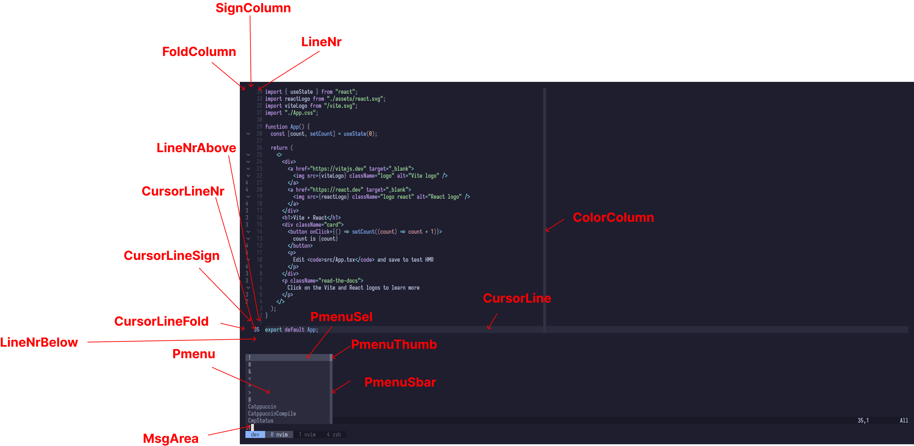
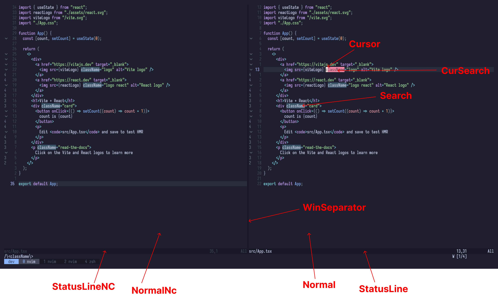
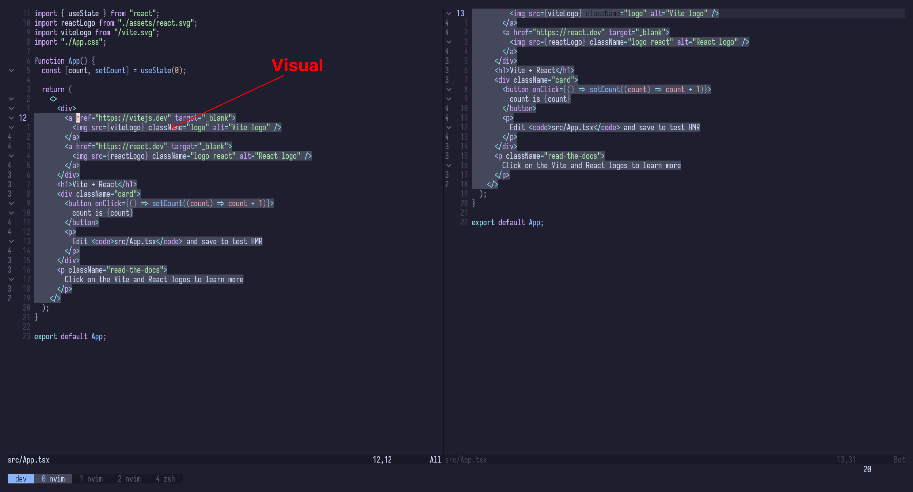
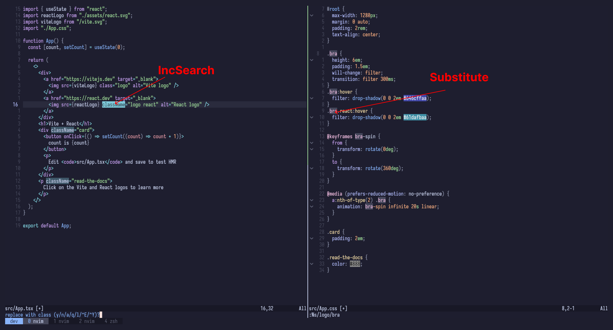
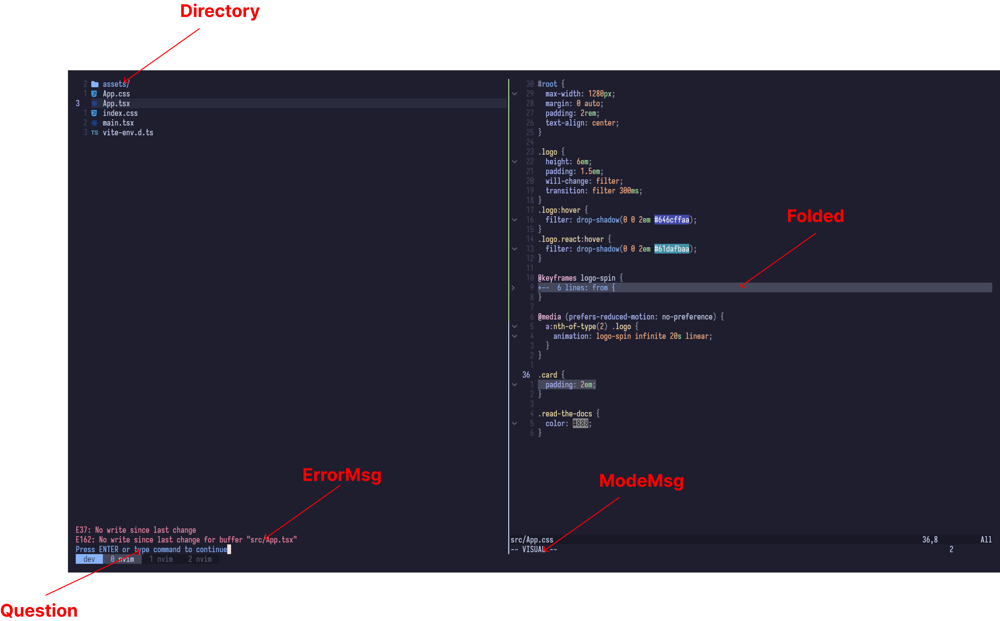

`ColorColumn` column when set with 'colorcolumn'.

`CursorLine` line at the cursor.

`FoldColumn` column when set 'foldcolumn’

`SignColumn` column where signs are displayed.

`LineNr` line number when set 'number’ or 'relativenumber'

`LineNrAbove` line number for when set 'relativenumber', above the cursor line.

`LineNrBelow` line number for when set 'relativenumber', below the cursor line.

`CursorLineNr` like LineNr when 'cursorline' is set for the cursor line.

`CursorLineFold` like FoldColumn when 'cursorline' is set for the cursor line.
`CursorLineSign` like SignColumn when 'cursorline' is set for the cursor line.

`Pmenu` popup menu: Normal item.
`PmenuSel` popup menu: Selected item.
`PmenuSbar` popup menu: Scrollbar.
`PmenuThumb` popup menu: Thumb of the scrollbar.

`MsgArea` area for messages and cmdline.

`Cursor` character under the cursor.

`CurSearch` used for highlighting a search pattern under the cursor.

`Normal` normal text.

`NormalNC` normal text in non-current windows.

`Search` last search pattern highlighting.

`StatusLine` status line of current window.

`StatusLineNC` status lines of not-current windows.

`WinSeparator` separators between window splits.

`Visual` visual mode selection.

`IncSearch` used for the text replaced with.

`Substitute` replacement text highlighting.

`Directory` directory names.

`ErrorMsg` error messages on the command line.

`Folded` line used for closed folds.

`ModeMsg` 'showmode' message (e.g., "-- INSERT --").

`Question` hit-enter prompt and yes/no questions.
